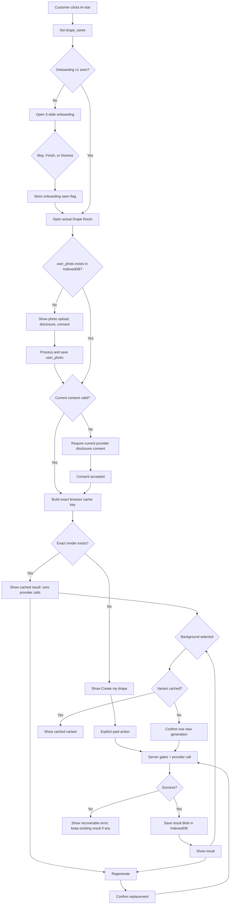

# FTT Drape Room — Storefront Integration Plan

**Document type:** Implementation-grade architecture and delivery plan  
**Status:** Pre-implementation authority; storefront source validation pending  
**Research snapshot:** 26 August 2026 (Asia/Kolkata)  
**Source reference repository:** `/Users/JP/Documents/codding projects/git/ftt-drape-room`  
**Target storefront repository:** `/Users/JP/Documents/codding projects/git/fromthetrunk-website`  
**Primary product decision:** GO  
**Generation policy:** No paid AI call from hover, render, onboarding, modal open, cache lookup, or option staging  
**Supported drape at launch:** Classic Nivi only  
**Image-persistence policy:** Customer and generated images remain browser-side; From the Trunk must not persist them in its database, object storage, filesystem, Redis, logs, analytics, or server cache

---

## 0. How to use this document

This document is the implementation authority for adding an FTT-native AI Drape Room to the existing From the Trunk storefront.

It intentionally does **not** instruct the implementer to copy the standalone `ftt-drape-room` application into the storefront. The standalone project is a research and reference implementation. Its useful prompt, photo-processing, accessibility, safety, and result-interaction ideas may be adapted. Its standalone catalogue, filesystem persistence, encrypted result cache, process-local controls, custom-wardrobe mode, multi-drape flow, and direct Gemini route must not be transplanted.

The user flow described here is locked. Implementation may improve reliability, accessibility, security, responsiveness, testability, and cost control, but it must not silently replace the requested journey with a different one.

The target-storefront file map in this version is based on the currently inspected remote storefront structure. After the storefront ZIP is supplied, perform a source-of-truth audit and update only the paths, types, integration details, and conflict notes. Do not use that later audit as an excuse to change the locked flow.

---

# 1. Locked product contract

## 1.1 One-sentence product promise

> Let a customer upload one photo, choose any eligible From the Trunk saree, and explicitly create a browser-saved AI preview of herself wearing that exact saree in a Classic Nivi drape.

## 1.2 Non-negotiable experience

1. A small circular AI-star control appears on eligible saree product cards and eligible saree product pages.
2. Hovering or keyboard-focusing the control reveals the text **Drape Room**.
3. Clicking the AI-star only opens Drape Room and selects that saree. It does not generate and does not spend money.
4. The first-ever Drape Room open in a browser shows a responsive three-slide onboarding carousel.
5. The onboarding contains a Skip action on every slide and appears only once for that onboarding version.
6. Slide 1 explains and optionally accepts the customer photo.
7. Slide 2 explains selecting a saree and dynamically shows the saree that the customer already clicked.
8. Slide 3 explains the generated-result experience and the AI disclaimer. It is not a paid generation.
9. After onboarding, the actual Drape Room opens for the already selected saree.
10. A missing customer photo is requested inside the actual Drape Room.
11. An existing customer photo is reused from browser storage.
12. The fixed drape is Classic Nivi. There is no drape selector.
13. The initial default background is Studio.
14. The first paid action is **Create my drape** or **Use photo and generate**.
15. The browser checks the exact result cache before enabling a provider call.
16. A matching cached result is shown immediately with zero provider calls.
17. Festival, Wedding, Party, and Birthday are separate background variants.
18. A cached background variant is shown immediately.
19. An uncached background requires an explicit confirmation and one new paid call.
20. Regenerate requires an explicit confirmation and one new paid call.
21. Reopening, rerendering, double-clicking, changing slides, hovering, or closing/reopening must not create duplicate charges.
22. The generated-result screen exposes exactly four primary actions:
    - Save image
    - Visit product
    - Wishlist
    - Add to cart
23. Share is not a required primary action.
24. The navbar shows a small circular customer-photo button only when a valid locally stored `user_photo` exists.
25. Replacing the customer photo invalidates old previews for normal display and never regenerates them automatically.
26. Removing the customer photo clears the local photo and associated local renders, but does not alter account, wishlist, cart, order, or product data.
27. Customer images and generated results are not persisted by FTT server-side.
28. The active AI provider, model, prompt version, and provider disclosure are selected and enforced by the server.
29. Google and OpenAI adapters are supported by the architecture.
30. Claude is not implemented as an image-output provider.
31. There is no automatic provider fallback.
32. The original customer photo plus the original selected product reference are used for every render. A generated result is never recursively edited to make the next background.
33. The original product page photography and product description remain the source of truth.
34. The full flow is responsive across mobile, tablet/iPad, laptop, and desktop.
35. Automated tests must never make a paid image-generation request.

## 1.3 What this feature is not

This launch is not:

- a standalone Drape Room website;
- a second product catalogue;
- a custom wardrobe uploader;
- a regional-drape selector;
- a fit or sizing guarantee;
- a product-photography replacement;
- a server-side image gallery;
- a customer-image database;
- an automatic background generator on every click;
- a provider marketplace exposed to the browser;
- an admin-controlled arbitrary prompt console;
- an async job system that stores results for later retrieval;
- a reason to duplicate the existing wishlist, stock, reservation, cart, product, media, or authentication systems.

---

# 2. Terminology and technical corrections

The requested names are retained, but their technical meaning must be precise.

| Product term | Technical implementation |
|---|---|
| `user_photo` | A processed JPEG `Blob` stored in IndexedDB under the exact logical key `user_photo` |
| `drape_saree` | The currently selected product in global React/Zustand state; not an image copied into browser storage |
| Product-name cache | Product name is metadata and a download filename; it is not the cache identity |
| “Local storage” in customer copy | Browser-local storage in the general sense |
| `localStorage` | Used only for small versioned flags and consent metadata |
| Generated-image storage | IndexedDB `Blob` records |
| “Server takes the photo” | The browser reads `user_photo` and sends it only after an explicit paid action |
| Provider/model choice | Server environment and allowlisted registry only |
| Nivi | Fixed server-side prompt compiler; no client field is accepted |
| Background selection | An allowlisted server-side enum |
| Cache hit | Browser IndexedDB result; no provider or generation-route call |
| Regenerate | A new paid render with a new idempotency key |
| Remove photo | Deletes local photo and local associated renders only |

A server cannot read `localStorage` or IndexedDB directly. Browser storage is isolated to the browser. The browser must explicitly include the processed photo in the generation request after consent and after the customer presses a paid-action button.

---

# 3. Research basis

## 3.1 X post reviewed

Requested source:

`https://x.com/mohamed_djoudir/status/2091886432923115582`

The direct X page and its media were not reliably retrievable in the audit environment. Search mirrors exposed the text-level proposition: an e-commerce-oriented Next.js template placing AI Virtual Try-On and AI Product Studio alongside a backend/admin surface.

### Valid lesson taken from the post

The useful product lesson is not “copy this template.” It is:

> Virtual try-on should live inside the shopping decision path, close to the product, the result, wishlist, cart, and product page—not as a disconnected experiment.

That lesson is incorporated through:

- AI-star entry points on cards and product pages;
- one globally mounted storefront-native Drape Room;
- the selected FTT product remaining the source of truth;
- result actions immediately connecting back to commerce;
- browser-cache reuse so returning to a saree feels instant;
- no second catalogue or separate admin architecture.

### Claims not made from the post

Because the embedded media could not be independently inspected, this plan does not claim that the post demonstrates:

- a particular model;
- a particular privacy architecture;
- browser-only storage;
- a specific provider;
- a specific caching mechanism;
- a specific prompt;
- a specific payment or rate-limit strategy;
- a NestJS or admin implementation suitable for FTT;
- a saree-aware or Nivi-aware fidelity method.

The locked FTT flow remains the authority.

## 3.2 Virtual try-on research findings

Research on image-based virtual try-on consistently treats the following as separate technical problems:

1. **Person identity preservation**
   - Face, skin tone, body proportions, pose, hair, age cues, accessories, and visible identity features can drift independently.
2. **Garment identity preservation**
   - Colour, texture, motifs, logos, weave, wrinkles, borders, and garment-specific details are frequently lost or redesigned.
3. **Geometry and body alignment**
   - A garment must be warped and aligned to the body without destroying appearance.
4. **Texture refinement**
   - Alignment alone is insufficient; high-frequency details need separate preservation/refinement.
5. **Inference efficiency**
   - A beautiful model that is too slow or too costly for a product-card flow is not commercially usable.
6. **Real-world generalisation**
   - Cropped photos, varied poses, lighting, backgrounds, and non-standard garments create failure modes that benchmark images may hide.

Relevant primary research:

- IDM-VTON, *Improving Diffusion Models for Authentic Virtual Try-on in the Wild*: https://arxiv.org/abs/2403.05139
- TryOn-Adapter, *Efficient Fine-Grained Clothing Identity Adaptation for High-Fidelity Virtual Try-On*: https://arxiv.org/abs/2404.00878
- FIP-VITON, *Time-Efficient and Identity-Consistent Virtual Try-On*: https://arxiv.org/abs/2403.07371
- DiffFit, *Disentangled Garment Warping and Texture Refinement for Virtual Try-On*: https://arxiv.org/abs/2506.23295

### FTT-specific inference

A saree is harder than a conventional upper-body garment because the commercial identity of the piece is distributed across:

- body fabric;
- motif scale and repetition;
- border width and continuity;
- pallu design;
- pleat geometry;
- waist wrap;
- shoulder placement;
- fabric behaviour;
- blouse hallucination;
- floor-length composition.

For FTT, a result that preserves the person but invents the border or pallu is a failure. A result that preserves the textile but produces a non-Nivi drape is also a failure. Therefore provider selection must use a scored quality matrix, not a subjective “looks pretty” decision.

## 3.3 Provider capability research

### Google

Google’s current Gemini image-generation documentation describes `gemini-3.1-flash-image` as an image generation/editing model supporting reference images, portrait aspect ratios including `3:4`, and 1K output. It supports more than the two references required here.

Primary references:

- https://ai.google.dev/gemini-api/docs/generate-content/image-generation
- https://ai.google.dev/gemini-api/docs/pricing
- https://ai.google.dev/gemini-api/docs/logs-policy
- https://ai.google.dev/gemini-api/terms

### OpenAI

OpenAI’s current model documentation describes `gpt-image-2` as an image input/output model for high-quality generation and editing with high-fidelity image inputs.

Primary references:

- https://developers.openai.com/api/docs/models/gpt-image-2
- https://developers.openai.com/api/docs/guides/image-generation
- https://platform.openai.com/docs/models/default-usage-policies-by-endpoint
- https://openai.com/api/pricing/

### Anthropic

Claude can analyse image inputs and create textual or code-based visual artefacts, but it is not a native photo/illustration image-output provider for this API requirement.

Reference:

- https://support.claude.com/en/articles/9002504-can-claude-produce-images

### Provider decision

Build both adapters behind one interface, but activate only one provider/model combination at launch after controlled Nivi fidelity, latency, cost, failure-rate, and privacy review.

There is no automatic fallback. A failed Google call must not silently become an OpenAI call, and vice versa.

## 3.4 Browser-storage research

IndexedDB is appropriate because it is asynchronous, same-origin, transaction-based, and can store structured objects and `Blob`/file data. Web Storage is synchronous and intended for small string values. Browser quotas and eviction are browser-controlled; writes must handle `QuotaExceededError`, and storage usage can be estimated using `navigator.storage.estimate()`.

Primary references:

- https://developer.mozilla.org/en-US/docs/Web/API/IndexedDB_API
- https://developer.mozilla.org/en-US/docs/Web/API/Storage_API/Storage_quotas_and_eviction_criteria
- https://developer.mozilla.org/en-US/docs/Web/API/StorageManager/estimate
- https://developer.mozilla.org/en-US/docs/Web/API/StorageManager/persist
- https://developer.mozilla.org/en-US/docs/Web/API/Web_Storage_API

## 3.5 Upload-security research

OWASP recommends server-side allowlisting, size bounds, not trusting a client-supplied content type, decoding/rewriting images, and deriving the safe output type from detected content.

Primary references:

- https://cheatsheetseries.owasp.org/cheatsheets/Input_Validation_Cheat_Sheet.html
- https://owasp.org/www-community/vulnerabilities/Unrestricted_File_Upload

## 3.6 Vercel constraints

Vercel currently documents a **4.5 MB maximum request body and 4.5 MB maximum response body** for a Vercel Function. Exceeding the limit returns `FUNCTION_PAYLOAD_TOO_LARGE`. The limit is not solved by upgrading the plan.

Vercel currently documents Fluid Compute defaults of 300 seconds for Hobby and Pro, with Pro configurable higher. Existing projects without Fluid Compute can have lower defaults. The implementation must verify the actual project setting before release.

Primary references:

- https://vercel.com/docs/functions/limitations
- https://vercel.com/kb/guide/how-to-bypass-vercel-body-size-limit-serverless-functions
- https://vercel.com/docs/functions/configuring-functions/duration

### Consequence

The standalone Drape Room’s seven-megabyte binary allowance encoded into base64 JSON is unsuitable for the storefront route. The storefront must use:

- browser-side compression;
- binary `multipart/form-data` input;
- raw binary image output;
- no base64 image response;
- strict transport budgets below the platform limit.

---

# 4. Architecture decision

## 4.1 Selected architecture

```text
FTT product card / product page
        |
        | click AI-star (zero paid calls)
        v
Global DrapeRoomProvider
        |
        +-- one-time onboarding flag in localStorage
        +-- selected drape_saree in React/Zustand
        +-- user_photo Blob in IndexedDB
        +-- render Blobs in IndexedDB
        |
        | explicit Create / uncached background / Regenerate
        v
POST /api/tryon/generate
        |
        +-- exact-Origin validation
        +-- signed anonymous session
        +-- idempotency
        +-- Upstash rate and concurrency controls
        +-- atomic monthly budget reservation
        +-- server-side product and media resolution
        +-- image validation and normalization
        +-- fixed Nivi prompt compiler
        +-- env-selected provider adapter
        +-- output validation and transcode
        |
        v
raw image bytes + non-sensitive metadata headers
        |
        v
browser Blob -> IndexedDB -> result screen
        |
        +-- Save
        +-- Visit product
        +-- Wishlist
        +-- Add to cart
```

## 4.2 Why this is storefront-native

The existing storefront remains responsible for:

- products;
- product images;
- stock;
- reservations;
- cart;
- wishlist;
- account/authentication;
- analytics consent;
- FAQ;
- legal policies;
- deployment;
- database;
- Upstash;
- UI design system.

The Drape Room contributes only:

- the local photo;
- the selected product projection;
- onboarding;
- generated preview;
- provider request;
- local preview cache;
- operational metadata.

## 4.3 Explicit no-image-persistence boundary

No customer or generated image may be written to:

- Neon/Postgres;
- Vercel Blob;
- S3/GCS/R2;
- Redis/Upstash;
- filesystem;
- `/tmp`;
- Next.js Data Cache;
- CDN cache;
- analytics;
- application logs;
- error-reporting attachments;
- audit renders;
- provider-response archives.

Transient in-memory buffers inside a single request are unavoidable and permitted. They must become unreachable at request completion.

---

# 5. Standalone Drape Room source audit

All paths in this section are exact local reference paths.

## 5.1 Reuse as concepts, not as copied modules

| Source path | Useful reference | Required storefront treatment |
|---|---|---|
| `/Users/JP/Documents/codding projects/git/ftt-drape-room/lib/prompt.ts` | Nivi wording; identity, fabric, realism, negative rules | Extract only Nivi-relevant concepts into a new fixed server compiler |
| `/Users/JP/Documents/codding projects/git/ftt-drape-room/lib/image.ts` | Browser decode, canvas normalization, resizing, download pattern | Rewrite to return compressed `Blob`, calculate SHA-256, and enforce Vercel budget |
| `/Users/JP/Documents/codding projects/git/ftt-drape-room/components/TryOnStage.tsx` | Dialog/result/loading/save/visit patterns; duplicate guard idea | Rebuild with FTT Radix components and locked onboarding/actual-modal separation |
| `/Users/JP/Documents/codding projects/git/ftt-drape-room/components/ModelPhoto.tsx` | Photo guidance and replace/remove patterns | Rebuild as onboarding upload plus navbar photo manager |
| `/Users/JP/Documents/codding projects/git/ftt-drape-room/lib/drapeSession.ts` | HMAC-signed anonymous-session concept | Rebuild with storefront naming, production `__Host-` cookie, and target env validation |
| `/Users/JP/Documents/codding projects/git/ftt-drape-room/lib/requestOrigin.ts` | Exact configured-Origin concept | Reuse approach with storefront production/preview policy |
| `/Users/JP/Documents/codding projects/git/ftt-drape-room/lib/providers/imageGenerationProvider.ts` | Adapter boundary concept | Redesign because current types remain Google-shaped |
| `/Users/JP/Documents/codding projects/git/ftt-drape-room/lib/gemini.ts` | Google transport and output validation ideas | Isolate inside Google adapter only |
| `/Users/JP/Documents/codding projects/git/ftt-drape-room/tests/provider-contract.test.ts` | Provider fixture and normalisation-test pattern | Build Google and OpenAI contract fixtures |
| `/Users/JP/Documents/codding projects/git/ftt-drape-room/tests/session-analytics.test.ts` | Signed-session and privacy-minimal analytics tests | Adapt to storefront session and metadata-only events |
| `/Users/JP/Documents/codding projects/git/ftt-drape-room/tests/safetyFoundation.test.ts` | Request, model, budget, and safety gate tests | Recreate against distributed controls and binary transport |

## 5.2 Important source anchors

### Current top-level wiring

`/Users/JP/Documents/codding projects/git/ftt-drape-room/components/DrapeRoomClient.tsx`

- `useModelPhoto()` around line 19
- selected product/custom state around line 21
- `selectProduct()` around line 33
- product-card rendering around line 156
- `TryOnStage` mount around lines 213–215

Lesson: one parent can own product selection and one modal. Storefront implementation should move this ownership to a global provider so product cards, PDP, and navbar can all open the same Drape Room.

### Current product card

`/Users/JP/Documents/codding projects/git/ftt-drape-room/components/ProductCard.tsx`

- the current card is effectively one large try-on button;
- hover copy appears around line 55.

Do not copy this structure. In FTT, the product link must remain the product link, wishlist must remain independent, and the Drape Room trigger must be a sibling overlay button.

### Current photo storage

`/Users/JP/Documents/codding projects/git/ftt-drape-room/lib/useModelPhoto.ts`

- current key: `ftt.tryon.model:v2`;
- localStorage hydration and write logic around lines 60–99.

Do not copy base64 image storage. Replace it with IndexedDB `Blob` storage using the exact logical key `user_photo`.

### Current photo processing

`/Users/JP/Documents/codding projects/git/ftt-drape-room/lib/image.ts`

- `fileToImage()` around line 66;
- canvas decode and re-encode around lines 90–104;
- download helper around line 114.

Retain the decode/re-encode principle because it normalises the image and removes source metadata. Rewrite for iterative byte-size compression and `Blob` output.

### Current prompt

`/Users/JP/Documents/codding projects/git/ftt-drape-room/lib/prompt.ts`

- Nivi instruction around lines 36–39;
- identity rules around line 83;
- fabric rules around line 94;
- realism rules around line 108;
- negative rules around line 116;
- prompt builder around line 141;
- arbitrary notes appended around line 193.

Use the Nivi, identity, textile, realism, and negative ideas. Remove all other drapes, auto mode, custom reference, custom garment types, and arbitrary notes.

### Current modal/generation UI

`/Users/JP/Documents/codding projects/git/ftt-drape-room/components/TryOnStage.tsx`

- backgrounds around line 11;
- multi-drape/custom state around lines 20 and 58–68;
- weak fingerprint around lines 37–38;
- generation function around line 90;
- duplicate key around lines 111–122;
- base64 JSON request around line 132;
- provider preflight around line 200;
- dialog around line 321;
- “Nothing is generated…” copy around line 503;
- background controls around line 604;
- arbitrary notes around line 621;
- Create my drape around lines 632–654;
- Save around line 682;
- Share around lines 691–712;
- Regenerate around lines 724–729;
- View product around line 745.

Retain the idea of an explicit paid CTA, save, visit, result state, timer/progress, and duplicate guard. Rebuild the rest.

### Current route

`/Users/JP/Documents/codding projects/git/ftt-drape-room/app/api/tryon/route.ts`

- Node runtime around line 47;
- `maxDuration = 300` around line 50;
- seven-megabyte input around line 52;
- multi-drape/background allowlists around lines 59–69;
- POST around line 509;
- strict Origin around line 549;
- signed session around line 552;
- session/request slots around lines 556–565;
- catalogue load around line 607;
- prompt around line 616;
- server cache around line 639;
- provider health around line 669;
- budget reservation around line 679;
- process-local generation slot around line 682;
- direct Gemini call around line 728;
- saved render around line 780;
- base64 JSON result around line 792 onward.

This route must be rewritten, not copied.

## 5.3 Explicit do-not-port list

Do not port:

- `/Users/JP/Documents/codding projects/git/ftt-drape-room/lib/catalogRepository.ts`
- `/Users/JP/Documents/codding projects/git/ftt-drape-room/lib/catalogIngestion.ts`
- `/Users/JP/Documents/codding projects/git/ftt-drape-room/lib/catalogSeed.ts`
- `/Users/JP/Documents/codding projects/git/ftt-drape-room/lib/catalogReview.ts`
- `/Users/JP/Documents/codding projects/git/ftt-drape-room/components/CatalogOperationsPanel.tsx`
- `/Users/JP/Documents/codding projects/git/ftt-drape-room/lib/resultCache.ts`
- `/Users/JP/Documents/codding projects/git/ftt-drape-room/lib/resultCacheRuntime.ts`
- `/Users/JP/Documents/codding projects/git/ftt-drape-room/components/ResultCacheSummaryPanel.tsx`
- `/Users/JP/Documents/codding projects/git/ftt-drape-room/lib/usage.ts` image-retention or filesystem logic
- `/Users/JP/Documents/codding projects/git/ftt-drape-room/components/UsageDashboard.tsx`
- `/Users/JP/Documents/codding projects/git/ftt-drape-room/lib/generationGuard.ts` process-local maps
- custom-wardrobe paths;
- custom garment uploads;
- drape-reference uploads;
- multi-drape selection;
- free-text stylist notes;
- encrypted server result cache;
- optional audit renders;
- `.data/` runtime state;
- direct route-to-Gemini coupling;
- base64 JSON input/output.

`/Users/JP/Documents/codding projects/git/ftt-drape-room/lib/resultCache.ts` defaults to a 24-hour server cache.  
`/Users/JP/Documents/codding projects/git/ftt-drape-room/lib/usage.ts` currently defaults `keepRenders` to true and contains saved-render/retention code.  
Both conflict with the locked FTT privacy promise and must remain outside the storefront implementation.

---

# 6. Provisional target-storefront integration map

These paths are based on the inspected storefront structure and must be revalidated after the storefront ZIP is supplied.

## 6.1 Existing files likely to be modified

| Provisional target path | Planned change |
|---|---|
| `/Users/JP/Documents/codding projects/git/fromthetrunk-website/components/providers.tsx` | Mount one lazily loaded global `DrapeRoomProvider` |
| `/Users/JP/Documents/codding projects/git/fromthetrunk-website/components/product/product-card.tsx` | Add eligible AI-star sibling overlay |
| `/Users/JP/Documents/codding projects/git/fromthetrunk-website/app/(site)/collection/[slug]/page.tsx` | Add PDP Drape Room trigger using the same selected-product projection |
| `/Users/JP/Documents/codding projects/git/fromthetrunk-website/components/layout/site-header-controls.tsx` | Add navbar photo button only after IndexedDB hydration and only when `user_photo` exists |
| `/Users/JP/Documents/codding projects/git/fromthetrunk-website/components/cart/add-to-cart-button.tsx` | Extract or expose reusable reservation action for Drape result without duplicating commerce logic |
| `/Users/JP/Documents/codding projects/git/fromthetrunk-website/components/product/wishlist-button.tsx` | Reuse or extract action logic so Drape result uses the same wishlist behaviour |
| `/Users/JP/Documents/codding projects/git/fromthetrunk-website/lib/media/product-image-resolver.ts` | Reuse approved current product image selection; add a dedicated try-on reference role only if required |
| `/Users/JP/Documents/codding projects/git/fromthetrunk-website/lib/adapters/upstash-rate-limiter.ts` | Reuse distributed rate-limit adapter; add atomic-lock capability through a separate Redis helper if needed |
| `/Users/JP/Documents/codding projects/git/fromthetrunk-website/db/schema.ts` | Add metadata-only budget/request ledger tables |
| `/Users/JP/Documents/codding projects/git/fromthetrunk-website/lib/seo/faq-content.ts` | Add Drape Room FAQ entries so page and FAQ JSON-LD remain aligned |
| `/Users/JP/Documents/codding projects/git/fromthetrunk-website/lib/legal/policies.ts` | Add canonical AI Virtual Drape privacy sections |
| `/Users/JP/Documents/codding projects/git/fromthetrunk-website/app/(site)/privacy-policy/page.tsx` | Validate whether this is legacy or canonical; do not maintain divergent privacy copy |
| `/Users/JP/Documents/codding projects/git/fromthetrunk-website/package.json` | Add only required dependencies and scripts after ZIP audit |
| `/Users/JP/Documents/codding projects/git/fromthetrunk-website/.env.example` | Document safe configuration without secrets |

## 6.2 New file family

Recommended target layout:

```text
components/drape-room/
  drape-room-provider.tsx
  drape-room-trigger.tsx
  drape-room-dialog.tsx
  drape-onboarding-carousel.tsx
  drape-photo-upload.tsx
  drape-photo-manager.tsx
  drape-navbar-photo-button.tsx
  drape-selected-saree.tsx
  drape-generation-progress.tsx
  drape-result-view.tsx
  drape-background-picker.tsx
  drape-result-actions.tsx
  drape-confirmation-dialog.tsx

lib/drape-room/
  types.ts
  constants.ts
  state-machine.ts
  storage.ts
  memory-storage.ts
  photo-processing.ts
  photo-digest.ts
  object-url.ts
  cache-key.ts
  cache-policy.ts
  download.ts
  consent.ts
  public-config.ts
  client-errors.ts

lib/drape-room/server/
  env.ts
  origin.ts
  session.ts
  request-schema.ts
  image-validation.ts
  product-reference.ts
  prompt.ts
  output-normalization.ts
  idempotency.ts
  rate-limit.ts
  concurrency.ts
  budget.ts
  operational-events.ts
  errors.ts

lib/drape-room/providers/
  types.ts
  registry.ts
  google-image-provider.ts
  openai-image-provider.ts
  google-response.ts
  openai-response.ts
  fixtures/

app/api/tryon/config/route.ts
app/api/tryon/generate/route.ts

db/queries/ai-tryon.ts
db/migrations/<generated-migration>.sql

tests/unit/drape-room/
tests/integration/drape-room/
tests/e2e/drape-room.spec.ts
```

Names may be adjusted after the target ZIP reveals existing conventions, but responsibilities must remain separated.

---

# 7. End-to-end state flow

## 7.1 Primary state machine



## 7.2 Paid-call matrix

| User/system action | API config/read call | Paid provider call |
|---|---:|---:|
| Product-card render | 0 | 0 |
| Product-page render | 0 | 0 |
| Hover/focus Drape Room | 0 | 0 |
| AI-star click | 0 | 0 |
| Open onboarding | 0 | 0 |
| Change onboarding slide | 0 | 0 |
| Skip/finish onboarding | 0 | 0 |
| Upload/process/save photo | 0 | 0 |
| Open navbar photo manager | 0 | 0 |
| Read browser cache | 0 | 0 |
| Show cached result | 0 | 0 |
| Reopen same cached result | 0 | 0 |
| Stage an uncached background | 0 | 0 |
| Confirm uncached background | 1 generation request | 1 |
| Create my drape | 1 generation request | 1 |
| Regenerate after confirmation | 1 generation request | 1 |
| Double-click paid action | 1 accepted request | 1 |
| React rerender/remount | 0 additional | 0 additional |
| Provider configuration bootstrap | 1 non-generating config call per browser session | 0 |
| Wishlist | existing wishlist request | 0 |
| Add to cart | existing reservation request | 0 |

---

# 8. Entry points

## 8.1 Eligibility

The UI may expose an active Drape Room trigger only when all client-known conditions are true:

- product type is saree;
- product is published;
- product has an approved, usable try-on reference;
- current stock is available for a new generation;
- feature flag is enabled for that environment.

The server must independently re-check all conditions.

Blouses must not generate. A client-forged product ID must not bypass this.

Reserved/sold products must not create a new image. If a matching browser-cached result already exists, the product can still be shown locally, but Add to cart remains governed by live inventory and the server refuses new generation.

## 8.2 Product-card trigger

Required visual behaviour:

- circular AI-star button;
- placed as a sibling of the product link;
- must not sit inside the `<Link>`;
- must not interfere with wishlist;
- recommended placement: lower-right of the product-image area because current wishlist occupies upper-right;
- expands or reveals **Drape Room** on hover and keyboard focus;
- mobile remains a clear circular control with accessible label;
- `aria-label="Open Drape Room for <product name>"`;
- minimum touch target 44×44 CSS pixels;
- `type="button"`;
- `preventDefault()` and `stopPropagation()` defensively;
- no prefetch or provider call.

Implementation skeleton:

```tsx
"use client";

import { Sparkles } from "lucide-react";
import { useDrapeRoom } from "@/components/drape-room/drape-room-provider";
import type { DrapeSaree } from "@/lib/drape-room/types";

export function DrapeRoomTrigger({
  saree,
  disabled = false,
}: {
  saree: DrapeSaree;
  disabled?: boolean;
}) {
  const { openForSaree } = useDrapeRoom();

  return (
    <button
      type="button"
      disabled={disabled}
      aria-label={`Open Drape Room for ${saree.productName}`}
      onClick={(event) => {
        event.preventDefault();
        event.stopPropagation();
        openForSaree(saree);
      }}
      className="group/drape inline-flex min-h-11 min-w-11 items-center justify-center
                 overflow-hidden rounded-full border backdrop-blur transition-[width,background-color]"
    >
      <Sparkles aria-hidden className="size-4 shrink-0" />
      <span
        className="max-w-0 overflow-hidden whitespace-nowrap opacity-0 transition-all
                   group-hover/drape:ml-2 group-hover/drape:max-w-28 group-hover/drape:opacity-100
                   group-focus-visible/drape:ml-2 group-focus-visible/drape:max-w-28
                   group-focus-visible/drape:opacity-100"
      >
        Drape Room
      </span>
    </button>
  );
}
```

Final classes must use FTT tokens and be tested against the actual card layout.

## 8.3 Product-page trigger

The PDP uses the same `DrapeRoomTrigger` and the same `DrapeSaree` projection. It must not create a separate modal implementation.

Recommended placement:

- close to Add to Bag and Wishlist;
- visually distinct but secondary to purchasing;
- visible above the mobile sticky purchase controls if those exist;
- stock-aware;
- no generation until explicit Create.

---

# 9. One-time onboarding carousel

## 9.1 Persistence key

```text
ftt.drape.onboarding.seen:v1
```

Allowed values:

```text
"true"
```

Absence means not seen.

Completing, skipping, or dismissing onboarding stores the flag. A future materially changed onboarding must use `v2`; never rewrite what `v1` means.

## 9.2 Carousel rules

- exactly three slides;
- one slide at a time;
- Back and Next controls;
- Skip visible on every slide;
- progress dots and `Step X of 3`;
- touch swipe may be supported, but buttons remain required;
- arrow-key support where appropriate;
- focus remains trapped inside the modal;
- heading changes are announced;
- reduced-motion preference disables non-essential slide animation;
- no paid call;
- no automatic generation;
- no hidden preloading that sends the customer photo to a provider.

## 9.3 Slide 1 — Upload your photo

### Headline

> Upload your photo

### Supporting copy

> Add one clear photo of yourself. A front-facing, full-length photo in good light gives the AI the best chance of preserving your face, body proportions, and the saree drape.

### Guidance

- One person only
- Full body strongly recommended
- Face visible
- Stand facing the camera
- Good, even lighting
- Avoid crossed arms
- Avoid heavy cropping
- Avoid strong blur or filters

### Behaviour

Uploading is optional during onboarding. Skip remains available.

When selected, the browser:

1. reads the file;
2. decodes and respects image orientation;
3. draws it onto a canvas;
4. thereby removes EXIF/GPS and unrelated metadata;
5. resizes to the maximum configured long edge;
6. iteratively compresses to a JPEG under the upload budget;
7. calculates SHA-256 over final processed bytes;
8. writes the processed `Blob` to IndexedDB key `user_photo`;
9. emits an in-browser storage-change event so the navbar updates;
10. does not send it to FTT or a provider.

## 9.4 Slide 2 — Choose a saree

### Headline

> Choose the saree you want to try

### Supporting copy

> Tap the AI-star marked Drape Room on any available saree card or product page.

Because the customer already clicked a saree, this slide dynamically displays:

- product image;
- product name;
- fabric;
- price;
- “Selected for your drape” state.

The customer does not select the product again.

## 9.5 Slide 3 — See your AI drape

### Headline

> See yourself in the saree

### Supporting copy

> Create a Classic Nivi preview, explore locally cached settings, save the image, return to the product, add it to your wishlist, or reserve it in your bag.

The slide shows a non-billable illustration/skeleton of:

- generated-image frame;
- background options;
- AI disclaimer;
- four result actions.

If a real exact cached result already exists, it may be shown. Otherwise, do not fake a personalised customer result.

### Required disclaimer

> This is an AI-generated visual preview. The actual saree’s colour, texture, pleats, border placement, pallu and fit may vary. Please use the original product photographs and description as the source of truth. Any blouse, jewellery or background shown may be AI-generated and is not included unless stated on the product page.

## 9.6 Skip behaviour

Skip from any slide must:

1. mark onboarding v1 as seen;
2. close onboarding;
3. retain the already selected `drape_saree`;
4. immediately open the actual Drape Room;
5. request a photo there if no `user_photo` exists;
6. never force the customer to click the product again.

---

# 10. Actual Drape Room states

## 10.1 State definitions

```ts
export type DrapeRoomView =
  | { type: "closed" }
  | { type: "onboarding"; step: 0 | 1 | 2 }
  | { type: "loading-local-state" }
  | { type: "photo-required" }
  | { type: "consent-required" }
  | { type: "checking-cache" }
  | { type: "ready-to-generate" }
  | { type: "generating"; requestId: string; startedAt: number }
  | { type: "result"; cacheKey: string }
  | { type: "confirm-background"; background: DrapeBackground }
  | { type: "confirm-regenerate" }
  | { type: "error"; code: DrapeClientErrorCode; recoverTo: "photo" | "ready" | "result" };
```

## 10.2 No photo

Show:

- selected saree;
- upload control;
- guidance;
- privacy disclosure;
- provider identity and retention summary;
- consent checkbox;
- disabled paid CTA until valid photo and current consent exist;
- CTA label: **Use photo and generate**.

The first use must not silently start generation merely because file selection completed. The customer explicitly presses the CTA after seeing the selected photo and disclosure.

## 10.3 Existing photo

Show:

- circular customer-photo thumbnail;
- Change photo;
- selected saree;
- fixed label: **Classic Nivi**;
- default background: **Studio**;
- current provider disclosure if consent is stale;
- local-cache lookup state;
- cached result or **Create my drape**.

## 10.4 Cache-first rule

Before a paid CTA can call the route:

1. read current processed photo metadata;
2. read selected product reference version;
3. read current public provider configuration;
4. build exact cache key;
5. check IndexedDB;
6. if found, show it and update `lastViewedAt`;
7. only show Create when no exact result exists.

## 10.5 Closing during generation

The global provider—not the modal component—owns the active request.

Closing the visual dialog:

- hides the dialog;
- does not remount or duplicate the request;
- may show a small non-intrusive progress state on the navbar photo control;
- allows reopening the same active request;
- does not issue a second request.

A browser navigation/unload can still terminate the connection. Because the provider may already have accepted a billable request, the server must classify that as an ambiguous outcome and must not auto-retry.

---

# 11. Navbar customer-photo control

## 11.1 Visibility

Show only when the IndexedDB `photos` store contains a valid `user_photo`.

Do not render:

- empty circle;
- generic person icon pretending to be a Drape photo;
- broken image;
- server-rendered guess.

A small localStorage hint may reduce initial flicker, but IndexedDB remains authoritative.

## 11.2 Hydration

The navbar is rendered in a server/client application. Therefore:

1. server render omits the local-photo button;
2. after client hydration, query IndexedDB asynchronously;
3. create a temporary object URL for the `Blob`;
4. render the circular image;
5. revoke object URL when replaced/unmounted.

## 11.3 Photo menu

The button opens a popover/dialog with:

- View current photo
- Replace photo
- Remove photo
- Open Drape Room

Open Drape Room:

- reopens the current `drape_saree` if one is selected in global state;
- otherwise closes the popover and navigates to `/collection` with a clear instruction to choose a saree and tap Drape Room;
- does not invent a second product picker.

## 11.4 Replace confirmation

Required copy:

> Changing your photo will make your existing AI drape previews incompatible with the new photo. New previews will need to be generated when you open a saree. Your existing images will not be regenerated automatically.

On confirmation:

1. process the new file;
2. calculate a new digest;
3. atomically replace `user_photo`;
4. delete renders associated with the old digest, or mark them unreachable and sweep immediately;
5. update navbar;
6. require new paid actions per saree;
7. never loop over products;
8. never auto-generate.

## 11.5 Remove confirmation

Required copy:

> Remove your photo and locally saved drape previews from this browser?

On confirmation, clear:

- `photos/user_photo`;
- renders for that photo digest;
- local photo-present hint;
- in-memory object URLs;
- current local result state.

Do not clear:

- account;
- login;
- wishlist;
- cart;
- reservations;
- addresses;
- orders;
- product history;
- general site cookies.

---

# 12. Browser storage design

## 12.1 Database

```text
Database: ftt_drape_room_v1
Version: 1
```

Object stores:

```text
photos
  keyPath: key
  record key: user_photo

renders
  keyPath: cacheKey
  indexes:
    userPhotoDigest
    productId
    lastViewedAt
    createdAt

metadata
  keyPath: key
```

`localStorage` keys:

```text
ftt.drape.onboarding.seen:v1
ftt.drape.consent:v1
ftt.drape.photo-present:v1
```

## 12.2 Types

```ts
export type StoredUserPhoto = {
  key: "user_photo";
  blob: Blob;
  mimeType: "image/jpeg";
  digest: string;
  width: number;
  height: number;
  byteSize: number;
  createdAt: number;
  updatedAt: number;
};

export type StoredDrapeRender = {
  cacheKey: string;
  blob: Blob;
  mimeType: "image/jpeg" | "image/webp";
  byteSize: number;

  userPhotoDigest: string;
  productId: string;
  productSlug: string;
  productName: string;
  productReferenceVersion: string;

  drape: "nivi";
  background: DrapeBackground;
  provider: DrapeProviderId;
  model: string;
  promptVersion: string;
  engineVersion: string;
  outputVersion: string;

  createdAt: number;
  lastViewedAt: number;
};

export type StoredConsent = {
  provider: DrapeProviderId;
  disclosureVersion: string;
  privacyPolicyVersion: string;
  acceptedAt: number;
};
```

## 12.3 IndexedDB helper skeleton

Use the existing project convention if a wrapper already exists. Otherwise either add the small `idb` package or implement a typed local helper.

```ts
const DB_NAME = "ftt_drape_room_v1";
const DB_VERSION = 1;

export async function openDrapeDb(): Promise<IDBDatabase> {
  return await new Promise((resolve, reject) => {
    const request = indexedDB.open(DB_NAME, DB_VERSION);

    request.onupgradeneeded = () => {
      const db = request.result;

      if (!db.objectStoreNames.contains("photos")) {
        db.createObjectStore("photos", { keyPath: "key" });
      }

      if (!db.objectStoreNames.contains("renders")) {
        const renders = db.createObjectStore("renders", { keyPath: "cacheKey" });
        renders.createIndex("userPhotoDigest", "userPhotoDigest");
        renders.createIndex("productId", "productId");
        renders.createIndex("lastViewedAt", "lastViewedAt");
        renders.createIndex("createdAt", "createdAt");
      }

      if (!db.objectStoreNames.contains("metadata")) {
        db.createObjectStore("metadata", { keyPath: "key" });
      }
    };

    request.onerror = () => reject(request.error ?? new Error("Unable to open Drape Room storage."));
    request.onsuccess = () => resolve(request.result);
  });
}
```

Every transaction must handle:

- `AbortError`;
- `QuotaExceededError`;
- `InvalidStateError`;
- private-mode/storage-disabled behaviour;
- upgrade failure;
- stale object URLs.

## 12.4 Storage policy

- maximum renders: 8;
- approximate Drape Room bytes: 40 MB;
- one processed customer photo;
- no fixed result TTL unless legal/product later requires one;
- LRU eviction before each render write;
- never evict `user_photo` to make room for a result;
- first evict oldest `lastViewedAt`;
- show a non-blocking message if storage becomes memory-only;
- allow `navigator.storage.estimate()` for diagnostics;
- optionally request persistent storage only after a successful user action; do not imply the browser must grant it.

## 12.5 LRU skeleton

```ts
const MAX_RENDER_COUNT = 8;
const MAX_RENDER_BYTES = 40 * 1024 * 1024;

export async function enforceRenderBudget(
  incomingBytes: number,
  excludeCacheKey?: string,
): Promise<void> {
  const renders = await listRenderMetadataOldestFirst();
  let bytes = renders.reduce((sum, item) => sum + item.byteSize, 0);
  let count = renders.length;

  for (const render of renders) {
    const overCount = count + 1 > MAX_RENDER_COUNT;
    const overBytes = bytes + incomingBytes > MAX_RENDER_BYTES;
    if (!overCount && !overBytes) break;
    if (render.cacheKey === excludeCacheKey) continue;

    await deleteRender(render.cacheKey);
    bytes -= render.byteSize;
    count -= 1;
  }

  if (count + 1 > MAX_RENDER_COUNT || bytes + incomingBytes > MAX_RENDER_BYTES) {
    throw new DrapeStorageError("quota");
  }
}
```

## 12.6 Memory fallback

When IndexedDB is unavailable:

- keep photo and results in one global in-memory store;
- allow current-tab generation;
- hide persistence language;
- show:

> This preview could not be saved in your browser and may disappear when you close or refresh the page.

---

# 13. Photo processing

## 13.1 Input policy

Client file selection may accept browser-decodable common image types. The processed output sent to the server is always JPEG.

Recommended source safeguards:

- source file hard maximum: 15 MB;
- decoded maximum pixels: 40 megapixels;
- minimum useful dimensions: warn below 640×800;
- one image only;
- no SVG;
- no PDF;
- no animated image output;
- no filename trust;
- no metadata retention.

## 13.2 Output budget

Target processed photo:

- JPEG;
- maximum long edge: 1280 px;
- byte target: ≤ 1.8 MB;
- never exceed 2.0 MB;
- retain aspect ratio;
- quality floor around 0.58–0.65;
- if still too large, progressively reduce dimensions.

This keeps the entire multipart request safely below Vercel’s 4.5 MB limit after form overhead.

## 13.3 Processing skeleton

```ts
const MAX_LONG_EDGE = 1280;
const TARGET_BYTES = 1_800_000;
const HARD_BYTES = 2_000_000;

export async function processUserPhoto(file: File): Promise<StoredUserPhoto> {
  if (file.size > 15 * 1024 * 1024) {
    throw new PhotoInputError("source-too-large");
  }

  const bitmap = await createImageBitmap(file, { imageOrientation: "from-image" });
  try {
    if (bitmap.width * bitmap.height > 40_000_000) {
      throw new PhotoInputError("too-many-pixels");
    }

    let { width, height } = contain(bitmap.width, bitmap.height, MAX_LONG_EDGE);
    let blob: Blob | null = null;

    for (let pass = 0; pass < 8; pass += 1) {
      const canvas = new OffscreenCanvas(width, height);
      const context = canvas.getContext("2d", { alpha: false });
      if (!context) throw new PhotoInputError("decode-failed");

      context.drawImage(bitmap, 0, 0, width, height);

      const quality = Math.max(0.6, 0.9 - pass * 0.05);
      blob = await canvas.convertToBlob({ type: "image/jpeg", quality });

      if (blob.size <= TARGET_BYTES) break;

      if (pass >= 4) {
        width = Math.max(640, Math.round(width * 0.9));
        height = Math.max(800, Math.round(height * 0.9));
      }
    }

    if (!blob || blob.size > HARD_BYTES) {
      throw new PhotoInputError("processed-too-large");
    }

    const digest = await sha256Hex(await blob.arrayBuffer());
    const now = Date.now();

    return {
      key: "user_photo",
      blob,
      mimeType: "image/jpeg",
      digest,
      width,
      height,
      byteSize: blob.size,
      createdAt: now,
      updatedAt: now,
    };
  } finally {
    bitmap.close();
  }
}
```

Use a normal canvas fallback where `OffscreenCanvas` is unavailable.

## 13.4 Suitability feedback

Do not run a paid semantic preflight during upload.

Use deterministic warnings:

- landscape orientation;
- unusually small dimensions;
- extreme aspect ratio;
- heavy source compression if detectable;
- missing browser decoder.

Warnings should not falsely claim face/body detection unless an actual local model is implemented and reviewed. The customer can continue after clear guidance unless the file is mechanically invalid.

---

# 14. Cache identity

## 14.1 Selected product projection

```ts
export type DrapeSaree = {
  productId: string;
  productSlug: string;
  productName: string;
  fabric: string | null;
  pricePaise: number;
  stockStatus: "available" | "reserved" | "sold";

  productImageUrl: string;
  productImageId: string;
  productReferenceVersion: string;
};
```

The image URL is for display only. The generation route never trusts or consumes a client image URL.

## 14.2 Product reference version

Build a stable version from server-owned data, for example:

```text
mediaAssetId + mediaAssetUpdatedAt + derivativeRole + derivativeObjectKey
```

Do not use only product name or only the visible URL.

The exact fields must be confirmed from the target ZIP/schema.

## 14.3 Public provider configuration

The browser needs non-secret configuration to build an exact cache key before generation:

```ts
export type PublicTryOnConfig = {
  enabled: boolean;
  provider: "google" | "openai";
  providerDisplayName: string;
  model: string;
  promptVersion: string;
  engineVersion: string;
  outputVersion: string;
  outputMimeType: "image/jpeg" | "image/webp";
  aspectRatio: "3:4";
  imageSize: "1K";
  disclosureVersion: string;
  privacyPolicyVersion: string;
  providerPolicyUrl: string;
  providerRetentionSummary: string;
};
```

`GET /api/tryon/config` must never expose:

- API keys;
- budget totals;
- internal rate limits;
- secret salts;
- raw provider errors;
- admin settings;
- database identifiers.

## 14.4 Cache key

```ts
export async function buildDrapeCacheKey(input: {
  userPhotoDigest: string;
  productId: string;
  productReferenceVersion: string;
  background: DrapeBackground;
  provider: DrapeProviderId;
  model: string;
  promptVersion: string;
  engineVersion: string;
  outputVersion: string;
}): Promise<string> {
  const canonical = [
    "ftt-drape",
    "v1",
    input.userPhotoDigest,
    input.productId,
    input.productReferenceVersion,
    "nivi",
    input.background,
    input.provider,
    input.model,
    input.promptVersion,
    input.engineVersion,
    input.outputVersion,
  ].join("|");

  return `tryon:${await sha256Hex(new TextEncoder().encode(canonical))}`;
}
```

## 14.5 Invalidation

A cache miss is required when any of these change:

- user photo;
- product ID;
- product reference media/version;
- background;
- provider;
- model;
- prompt version;
- engine version;
- output encoding/configuration.

A disclosure-only update requires renewed consent for a new paid call. A previously cached image can remain viewable because displaying it sends nothing to the provider.

---

# 15. Global client architecture

## 15.1 Provider ownership

Mount one provider in the existing global provider tree.

```tsx
export function Providers({ children }: { children: React.ReactNode }) {
  return (
    <SessionProvider>
      <QueryClientProvider client={queryClient}>
        <DrapeRoomProvider>
          {children}
        </DrapeRoomProvider>
      </QueryClientProvider>
    </SessionProvider>
  );
}
```

The Drape Room UI may be dynamically imported with `ssr: false`, but the lightweight context must be available to product triggers.

## 15.2 Context contract

```ts
export type DrapeRoomContextValue = {
  selectedSaree: DrapeSaree | null;
  userPhoto: StoredUserPhoto | null;
  view: DrapeRoomView;
  activeBackground: DrapeBackground;
  activeRender: StoredDrapeRender | null;

  openForSaree(saree: DrapeSaree): void;
  close(): void;
  skipOnboarding(): void;
  completeOnboarding(): void;

  savePhoto(file: File): Promise<void>;
  replacePhoto(file: File): Promise<void>;
  removePhoto(): Promise<void>;

  createDrape(): Promise<void>;
  requestBackground(background: DrapeBackground): Promise<void>;
  confirmBackground(): Promise<void>;
  requestRegenerate(): void;
  confirmRegenerate(): Promise<void>;
};
```

## 15.3 Reducer invariants

- `OPEN_FOR_SAREE` never generates.
- onboarding never generates.
- `PHOTO_SAVED` never generates.
- `SELECT_BACKGROUND` never generates by itself.
- `CREATE_CONFIRMED` is the only initial-generation transition.
- `BACKGROUND_CONFIRMED` generates only after cache miss.
- `REGENERATE_CONFIRMED` generates with a fresh idempotency key.
- at most one active request per provider instance.
- close does not reset in-flight identity.
- failure does not delete an existing result.
- success writes to IndexedDB before replacing visible result where possible.
- a cache hit never invokes `/api/tryon/generate`.

---

# 16. Responsive UI

## 16.1 Mobile

- full-screen or near-full-height bottom sheet;
- safe-area padding;
- one onboarding slide at a time;
- sticky Back/Next/Skip actions;
- result image remains primary;
- background chips scroll horizontally;
- four result actions in a 2×2 grid;
- no hover-dependent information;
- minimum 44×44 controls;
- loading state remains visible if keyboard closes/reopens;
- browser file picker does not reset selected product.

## 16.2 Tablet/iPad

- centred modal;
- balanced product/photo summary;
- wider carousel;
- result actions in a 2×2 or balanced grid;
- no desktop-only assumptions about pointer hover;
- test portrait and landscape orientation.

## 16.3 Laptop/desktop

- large centred modal;
- split layout:
  - left: selected product and customer-photo context;
  - right: result/generation state;
- background controls below result;
- four primary actions in one row when space allows;
- hover/focus label on AI-star;
- focus trap and Escape close;
- closing during generation preserves global request state.

## 16.4 Accessibility

- Radix Dialog/Sheet primitives from the storefront;
- one visible dialog title;
- descriptive text;
- focus returned to the exact trigger;
- status changes in `aria-live="polite"`;
- errors in `role="alert"` where necessary;
- progress has text, not spinner only;
- all local images have meaningful alt text;
- no colour-only state;
- reduced motion respected;
- keyboard traversal tested;
- nested wishlist authentication dialog tested carefully.

---

# 17. Result screen

## 17.1 Required content

- large generated image;
- product thumbnail;
- product name;
- Classic Nivi;
- active background;
- cached/generated state may be shown subtly;
- AI disclaimer;
- background options;
- Regenerate;
- four primary actions.

## 17.2 Four primary actions

### Save image

- read the active render `Blob`;
- create object URL;
- trigger download;
- revoke URL;
- filename:

```text
from-the-trunk-<product-slug>-nivi-drape.jpg
```

### Visit product

- route to `/collection/<slug>`;
- if already on that page, close modal and restore page context;
- no generation.

### Wishlist

- use the existing account/auth/wishlist flow;
- do not introduce a Drape-specific wishlist table or store;
- preserve optimistic updates and sign-in behaviour.

### Add to cart

- use the existing reservation endpoint and cart store;
- re-check current inventory;
- do not trust the stock captured when generation began;
- if sold/reserved, disable and explain;
- do not duplicate reservation logic.

## 17.3 Commerce refactor recommendation

Extract shared action logic if existing buttons are too visually specific:

```text
useWishlistAction(product)
useReserveAndAddProduct(product)
```

Then use those hooks from:

- existing WishlistButton;
- existing AddToCartButton;
- Drape result icon buttons.

This preserves one business implementation while allowing the requested icon-based result UI.

---

# 18. Background variants

```ts
export const DRAPE_BACKGROUNDS = [
  "studio",
  "festival",
  "wedding",
  "party",
  "birthday",
] as const;

export type DrapeBackground = (typeof DRAPE_BACKGROUNDS)[number];
```

## 18.1 Fixed instructions

```ts
const BACKGROUND_INSTRUCTIONS: Record<DrapeBackground, string> = {
  studio:
    "Place the person in a refined warm-ivory luxury fashion studio with soft, even editorial lighting and a natural floor shadow.",
  festival:
    "Place the person in an elegant Indian festive setting with restrained marigold details, warm ambient light, and subtle diya-style bokeh. Keep the person and saree unobstructed.",
  wedding:
    "Place the person in a refined Indian wedding venue with tasteful floral decor and warm ambient lighting. Do not automatically portray the person as the bride and do not add bridal symbols unless present in the source photo.",
  party:
    "Place the person in a tasteful evening celebration setting with soft ambient lighting and restrained decor. Keep the saree as the visual focus.",
  birthday:
    "Place the person in an elegant birthday setting with subtle balloons or cake details and soft bokeh. Do not generate readable banners, names, numbers, or text.",
};
```

## 18.2 Behaviour

- initial render: Studio;
- selecting cached variant: immediate;
- selecting uncached variant: open confirmation;
- confirmation copy:

> Creating the Wedding setting will generate a new AI image. Continue?

- one paid call after confirmation;
- source inputs remain original `user_photo` and original server-resolved product reference;
- never use current generated image as provider input;
- separate cache key per background.

---

# 19. Regeneration

Required confirmation:

> Regenerating creates a new AI image and may use another generation. Your current locally saved preview will be replaced for this saree and setting. Continue?

Rules:

- explicit confirmation;
- new random idempotency key;
- same configured provider and model;
- same original inputs;
- same background;
- same prompt/engine versions;
- write new result only on success;
- preserve old result on any failure;
- no automatic retry after an ambiguous upstream outcome;
- no fallback;
- ledger records `regeneration=true`;
- client rate limit applies.

---

# 20. API surface

## 20.1 Public config

```text
GET /api/tryon/config
```

Responsibilities:

- return non-secret active configuration;
- set/refresh signed anonymous session when needed;
- `Cache-Control: private, no-store`;
- no generation;
- no provider health call on every request;
- no budget disclosure.

## 20.2 Generate

```text
POST /api/tryon/generate
Content-Type: multipart/form-data
```

Fields:

```text
photo               processed JPEG Blob
productId           UUID/string matching target schema
background          studio|festival|wedding|party|birthday
idempotencyKey      random UUID generated for this deliberate action
regeneration        "true" only for confirmed regenerate
```

Reject every extra field.

The client must not send:

- product URL;
- product image;
- provider;
- model;
- prompt;
- drape;
- notes;
- garment type;
- output size;
- cache bypass;
- custom background text;
- arbitrary JSON.

## 20.3 Response

Success:

```http
HTTP/1.1 200 OK
Content-Type: image/jpeg
Cache-Control: private, no-store
Pragma: no-cache
X-Content-Type-Options: nosniff
X-FTT-Tryon-Request-Id: <opaque id>
X-FTT-Tryon-Provider: google
X-FTT-Tryon-Model: gemini-3.1-flash-image
X-FTT-Tryon-Prompt-Version: nivi-v1
X-FTT-Tryon-Engine-Version: storefront-v1
X-FTT-Tryon-Output-Version: jpeg-1k-v1

<raw image bytes>
```

Keep the response below approximately 3.8 MB to leave margin under Vercel’s 4.5 MB limit.

Errors return small JSON:

```json
{
  "code": "TRYON_RATE_LIMITED",
  "message": "You’ve created several previews recently. Please try again later.",
  "requestId": "opaque"
}
```

Do not expose raw provider body, stack, prompt, model response, image data, budget, API key, or internal exception.

---

# 21. Generation-route sequence

```ts
export const runtime = "nodejs";
export const maxDuration = 240;

export async function POST(request: NextRequest): Promise<Response> {
  const requestId = newOpaqueRequestId();

  // 1. Feature/config
  const env = getTryOnEnv();
  if (!env.enabled) return publicError("TRYON_DISABLED", 503, requestId);

  // 2. Same-origin and session
  assertExactAllowedOrigin(request, env.allowedOrigins);
  const session = requireSignedTryOnSession(request, env.sessionSecret);

  // 3. Bounded multipart parse
  const form = await readBoundedTryOnForm(request);
  const input = validateTryOnForm(form); // rejects extra fields

  // 4. Distributed limits and idempotency
  const rate = await checkTryOnLimits({ session, request });
  if (!rate.allowed) return rateLimitResponse(rate, requestId);

  const claim = await claimIdempotency({
    sessionTag: session.tag,
    idempotencyKey: input.idempotencyKey,
    requestId,
  });
  if (!claim.claimed) return duplicateResponse(claim, requestId);

  const releaseConcurrency = await acquireDistributedGenerationSlot(session.tag);

  try {
    // 5. Server product authority
    const product = await getEligibleTryOnProduct(input.productId);
    const reference = await resolveTryOnReference(product);

    // 6. Decode, validate, re-encode
    const person = await normalizeUploadedPersonImage(input.photo);
    const garment = await fetchAndNormalizeProductReference(reference);

    // 7. Fixed prompt
    const prompt = compileNiviPrompt({
      background: input.background,
      product,
    });

    // 8. Cost reserve
    const provider = getConfiguredTryOnProvider(env);
    const forecast = provider.estimateMaximumCost({
      referenceCount: 2,
      output: env.output,
    });

    const reservation = await reserveMonthlyTryOnBudget({
      requestId,
      forecastMicroUsd: forecast.microUsd,
      productId: product.id,
      sessionTag: session.tag,
      background: input.background,
      provider: provider.id,
      model: env.model,
      regeneration: input.regeneration,
    });

    // 9. Provider call — no automatic cross-provider fallback
    const result = await provider.generate({
      model: env.model,
      prompt,
      person,
      garment,
      aspectRatio: "3:4",
      imageSize: "1K",
      signal: AbortSignal.timeout(env.providerTimeoutMs),
    });

    // 10. Validate/transcode
    const output = await normalizeGeneratedOutput(result.image, {
      maxBytes: 3_800_000,
      mimeType: "image/jpeg",
      maxLongEdge: 1536,
    });

    // 11. Settle metadata only
    await settleTryOnSuccess({
      reservation,
      servedModel: result.servedModel,
      actualMicroUsd: result.usage.actualMicroUsd,
      outputByteSize: output.bytes.byteLength,
      latencyMs: result.latencyMs,
    });

    await markIdempotencyCompleted({ requestId });

    return binaryTryOnResponse(output, {
      requestId,
      provider: provider.id,
      model: result.servedModel,
      promptVersion: env.promptVersion,
      engineVersion: env.engineVersion,
      outputVersion: env.outputVersion,
    });
  } catch (error) {
    await settleTryOnFailureConservatively({ requestId, error });
    await markIdempotencyFailed({ requestId, errorCode: publicErrorCode(error) });
    return mapTryOnError(error, requestId);
  } finally {
    await releaseConcurrency();
  }
}
```

The final code must distinguish:

- no provider call occurred;
- provider definitively rejected before billing;
- provider may have accepted/charged;
- provider succeeded;
- output was invalid after provider success.

Ambiguous outcomes retain the conservative reservation.

---

# 22. Provider-neutral interface

The existing standalone interface is not fully provider-neutral because its API-family and usage types are Google-specific.

Use a binary, provider-independent contract:

```ts
export type DrapeProviderId = "google" | "openai";

export type BinaryImage = {
  bytes: Uint8Array;
  mimeType: "image/jpeg" | "image/png" | "image/webp";
};

export type TryOnGenerationInput = {
  model: string;
  prompt: string;
  person: BinaryImage;
  garment: BinaryImage;
  aspectRatio: "3:4";
  imageSize: "1K";
  signal: AbortSignal;
};

export type TryOnProviderUsage = {
  providerReported: boolean;
  inputUnits: number | null;
  outputUnits: number | null;
  actualMicroUsd: number | null;
  rawUsageVersion: string;
};

export type TryOnGenerationResult = {
  image: BinaryImage;
  servedModel: string;
  usage: TryOnProviderUsage;
  latencyMs: number;
};

export type ProviderDisclosure = {
  providerDisplayName: string;
  policyUrl: string;
  retentionSummary: string;
  disclosureVersion: string;
};

export interface TryOnImageProvider {
  readonly id: DrapeProviderId;
  readonly disclosure: ProviderDisclosure;

  supportsModel(model: string): boolean;

  generate(input: TryOnGenerationInput): Promise<TryOnGenerationResult>;

  estimateMaximumCost(input: {
    model: string;
    referenceCount: 2;
    imageSize: "1K";
  }): { microUsd: number; conservative: true };

  healthCheck(input: {
    model: string;
    signal: AbortSignal;
  }): Promise<{ ok: boolean; checkedAt: string; reasonCode?: string }>;
}
```

Raw wire responses terminate inside their provider adapter.

---

# 23. Provider registry

```ts
const providers: Record<DrapeProviderId, TryOnImageProvider> = {
  google: createGoogleTryOnProvider(),
  openai: createOpenAiTryOnProvider(),
};

export function getConfiguredTryOnProvider(
  env: TryOnEnv,
): TryOnImageProvider {
  const provider = providers[env.provider];

  if (!provider.supportsModel(env.model)) {
    throw new TryOnConfigurationError(
      `Model ${env.model} is not allowlisted for provider ${env.provider}.`,
    );
  }

  return provider;
}
```

Allowlist examples:

```ts
const GOOGLE_MODELS = new Set([
  "gemini-3.1-flash-image",
]);

const OPENAI_MODELS = new Set([
  "gpt-image-2",
  "gpt-image-2-2026-04-21",
]);
```

Model IDs are current research snapshots, not permanent truths. Deployment must fail closed when an env value is not in the application allowlist, and launch must re-check current provider documentation.

---

# 24. Google adapter plan

Source reference:

`/Users/JP/Documents/codding projects/git/ftt-drape-room/lib/gemini.ts`

Storefront adapter responsibilities:

- use only Google wire format inside adapter;
- include two reference images:
  1. customer;
  2. exact saree;
- append fixed server prompt;
- request image output;
- request `3:4`, `1K`;
- parse every candidate/part safely;
- reject missing image;
- reject unsupported MIME;
- validate provider-reported model if present;
- normalise usage;
- never log prompt or image;
- no automatic model fallback;
- no automatic retry after an ambiguous accepted request.

A narrowly bounded retry may only be considered for a failure proven to occur before the provider accepted a billable request. Default first release: no automatic retry.

---

# 25. OpenAI adapter plan

Use the current image-editing endpoint compatible with `gpt-image-2`.

Responsibilities:

- use only OpenAI wire format inside adapter;
- send original customer and garment references;
- use high input fidelity where supported and cost-approved;
- fixed server prompt;
- portrait output closest to `3:4`;
- parse base64/binary response without storing;
- normalise usage and served model;
- enforce adapter model allowlist;
- no automatic fallback;
- no raw provider error in customer response.

The exact endpoint parameters must be verified against current official documentation during implementation because image API schemas may change.

---

# 26. Environment contract

Recommended `.env.example` entries:

```dotenv
# Master feature gate
FTT_TRYON_ENABLED=false

# Exact public origins, comma-separated
FTT_TRYON_ALLOWED_ORIGINS=https://fromthetrunk.shop,https://www.fromthetrunk.shop

# Provider selection
FTT_TRYON_PROVIDER=google
FTT_TRYON_MODEL=gemini-3.1-flash-image

# Provider credentials
FTT_TRYON_GOOGLE_API_KEY=
FTT_TRYON_OPENAI_API_KEY=

# Publicly cache-identifying versions
FTT_TRYON_PROMPT_VERSION=nivi-v1
FTT_TRYON_ENGINE_VERSION=storefront-v1
FTT_TRYON_OUTPUT_VERSION=jpeg-1k-v1
FTT_TRYON_DISCLOSURE_VERSION=provider-disclosure-v1
FTT_PRIVACY_POLICY_VERSION=2026-08-ai-v1

# Security
FTT_TRYON_SESSION_SECRET=
FTT_TRYON_HMAC_SECRET=
FTT_TRYON_IP_HASH_SECRET=

# Cost
FTT_TRYON_MONTHLY_LIMIT_MICRO_USD=
FTT_TRYON_FORECAST_FX_VERSION=

# Runtime
FTT_TRYON_PROVIDER_TIMEOUT_MS=210000
FTT_TRYON_MAX_DURATION_SECONDS=240

# Distributed infrastructure
UPSTASH_REDIS_REST_URL=
UPSTASH_REDIS_REST_TOKEN=
```

Validation skeleton:

```ts
const TryOnEnvSchema = z.object({
  FTT_TRYON_ENABLED: z.enum(["true", "false"]).default("false"),
  FTT_TRYON_ALLOWED_ORIGINS: z.string().min(1),
  FTT_TRYON_PROVIDER: z.enum(["google", "openai"]),
  FTT_TRYON_MODEL: z.string().min(1),
  FTT_TRYON_SESSION_SECRET: z.string().min(32),
  FTT_TRYON_HMAC_SECRET: z.string().min(32),
  FTT_TRYON_IP_HASH_SECRET: z.string().min(32),
  FTT_TRYON_MONTHLY_LIMIT_MICRO_USD: z.coerce.bigint().positive(),
  FTT_TRYON_PROMPT_VERSION: z.string().min(1),
  FTT_TRYON_ENGINE_VERSION: z.string().min(1),
  FTT_TRYON_OUTPUT_VERSION: z.string().min(1),
});
```

Rules:

- feature defaults off;
- selected provider key required;
- unselected provider key optional;
- secrets never use `NEXT_PUBLIC_`;
- no provider/model from request;
- no silent default model in production;
- invalid config makes config endpoint report disabled and generation fail closed;
- provider privacy disclosure must match selected provider.

---

# 27. Fixed Nivi prompt compiler

## 27.1 Prompt principles

The prompt must protect:

- same person;
- face;
- expression;
- skin tone;
- body proportions;
- height/build;
- pose;
- hair;
- visible identity details;
- exact saree colour;
- weave;
- motifs;
- motif scale;
- border width/colour/detail;
- pallu design;
- fabric behaviour;
- Classic Nivi geometry;
- anatomy;
- single full-body result;
- selected background;
- no text/watermark/collage.

## 27.2 Compiler skeleton

```ts
export function compileNiviPrompt(input: {
  background: DrapeBackground;
  product: {
    name: string;
    fabric: string | null;
  };
}): string {
  return [
    "You are the controlled virtual-drape engine for From the Trunk.",
    "",
    "INPUTS",
    "IMAGE 1 is the real customer and is the only identity and body source.",
    "IMAGE 2 is the exact selected From the Trunk saree and is the only textile source.",
    "",
    "TASK",
    "Create one photorealistic full-length front-view fashion image of the person from IMAGE 1 wearing the exact saree from IMAGE 2 in a Classic Nivi drape.",
    "",
    "CLASSIC NIVI GEOMETRY",
    "- Wrap and tuck the saree securely at the waist.",
    "- Form five to seven clean front knife pleats centred at the waist.",
    "- Let the pleats fall vertically and naturally toward the floor.",
    "- Carry the pallu diagonally across the torso and place it over the LEFT shoulder.",
    "- Keep the decorative pallu recognisable and let its end fall naturally behind.",
    "- Keep the saree border continuous and correctly positioned along the waist, pleats, hem, torso and pallu.",
    "",
    "PRESERVE THE PERSON",
    "- Preserve the same face, facial structure, eyes, nose, mouth, brows and expression.",
    "- Preserve exact skin tone and undertone. Do not lighten, darken or beautify.",
    "- Preserve real body shape, height and proportions. Do not slim, lengthen or reshape.",
    "- Preserve hairstyle, hair colour and hairline.",
    "- Preserve the source pose and camera angle wherever compatible with a full-length result.",
    "- Preserve existing glasses, bindi, jewellery and footwear unless naturally covered by the saree.",
    "",
    "PRESERVE THE EXACT SAREE",
    "- Reproduce the exact hue, saturation and depth from IMAGE 2.",
    "- Preserve the weave, print, motifs and motif scale.",
    "- Do not invent, remove, resize, redraw or rearrange motifs.",
    "- Preserve the border width, colour, zari and embroidery details.",
    "- Preserve the distinct pallu design and its difference from the saree body.",
    "- Match the real fabric behaviour and weight.",
    "",
    "BLOUSE",
    "- Add one restrained, well-fitted blouse derived from colours already present in the saree.",
    "- Do not add unrelated embroidery, logos or a second textile design.",
    "",
    "SCENE",
    `- ${BACKGROUND_INSTRUCTIONS[input.background]}`,
    "",
    "REALISM AND ANATOMY",
    "- Use believable gravity, folds, contact shadows and fabric weight.",
    "- Keep hands, fingers, arms, feet and body anatomy natural.",
    "- Keep the person and saree sharp and unobstructed.",
    "- High-end editorial e-commerce realism.",
    "",
    "DO NOT",
    "- Do not change the person into someone else.",
    "- Do not create multiple people.",
    "- Do not create a collage or split screen.",
    "- Do not show the original clothing beneath the saree.",
    "- Do not add text, labels, captions, logos or watermarks.",
    "- Do not use the background to cover the saree.",
    "",
    "Return exactly one final image and no explanation.",
  ].join("\n");
}
```

## 27.3 Client-prompt prohibition

The request schema rejects:

- notes;
- prompt;
- custom background;
- drape;
- stylist instructions.

This prevents prompt injection and unstable commercial behaviour.

---

# 28. Product and media authority

## 28.1 Server-side product query

The generation route receives only `productId`.

The server must query the current product and verify:

- exists;
- published;
- type is saree;
- current effective stock available;
- no active conflicting reservation;
- approved product media exists;
- media host/path passes existing policy;
- media is suitable for generation;
- product is not draft/archived/deleted.

## 28.2 Reference selection

Use the best original/current product reference, not a tiny card derivative.

Priority, subject to target media policy:

1. approved dedicated try-on/reference derivative;
2. PDP derivative with sufficient dimensions/detail;
3. approved original only when bounded and safe.

The reference must visibly contain enough body fabric, border, and pallu information. If one image cannot represent all critical textile features, the first release must either:

- designate a stronger approved reference; or
- extend provider input to additional server-owned reference images after explicit QA.

Do not allow browser-submitted product images.

## 28.3 Fetch safety

For external media:

- use existing approved host/path policy;
- restrict HTTPS;
- bound redirects;
- reject private/special network destinations;
- bound content length;
- timeout;
- inspect magic bytes;
- decode with Sharp;
- cap pixels;
- re-encode;
- never store.

If the target media is already held by an approved internal storage adapter, use that path instead of arbitrary fetch.

---

# 29. Image validation and output normalisation

## 29.1 Customer input

Validate server-side even though client processed it:

- multipart field count;
- exact field names;
- photo byte size;
- JPEG/PNG/WebP allowlist if accepting fallbacks;
- magic bytes;
- decode success;
- dimensions;
- total pixels;
- animation/frame count;
- colour space;
- timeout;
- re-encode to controlled JPEG;
- no metadata retention.

## 29.2 Provider output

Validate:

- response exists;
- exactly one accepted image chosen;
- MIME allowlist;
- canonical base64 if provider uses it;
- decoded byte limit;
- magic bytes;
- Sharp decode;
- dimensions;
- pixel count;
- no animation;
- output orientation;
- output transcode;
- final ≤ 3.8 MB.

Response headers:

```http
Cache-Control: private, no-store
Pragma: no-cache
X-Content-Type-Options: nosniff
Content-Disposition: inline; filename="ftt-drape-preview.jpg"
```

Do not use CDN `s-maxage`.

---

# 30. Session, Origin, CSRF, and request integrity

## 30.1 Cookie

Production cookie:

```text
__Host-ftt-tryon-session
```

Properties:

- HttpOnly
- Secure
- SameSite=Strict
- Path=/
- no Domain
- signed/HMAC authenticated
- opaque random session identifier
- bounded lifetime
- rotation/version support

Development may use a non-`__Host-` cookie on local HTTP, but production must use the strict cookie.

## 30.2 Exact Origin

For generation:

- require `Origin`;
- exact match against configured allowlist;
- reject `null`;
- reject arbitrary Vercel preview unless explicitly configured;
- validate `Sec-Fetch-Site` where available;
- do not derive authority from untrusted Host headers;
- previews default to try-on disabled unless deliberately enabled.

## 30.3 Idempotency

Client generates a UUID for each deliberate paid action.

Server stores only an HMAC of:

```text
sessionTag + idempotencyKey
```

with unique constraint/atomic claim.

Duplicate outcomes:

- in progress: `409 TRYON_ALREADY_PROCESSING`;
- completed: `409 TRYON_ALREADY_COMPLETED`;
- failed definitively before provider: client may create a new explicit action;
- ambiguous failure: no automatic retry.

Because no server image is retained, a lost successful response cannot be replayed from the server. This trade-off must be accepted to preserve the no-server-image-storage promise.

---

# 31. Distributed cost and abuse controls

## 31.1 Initial limits

Provisional launch limits:

```text
Concurrent per browser session: 1
Generations per session per 10 minutes: 3
Generations per session per 24 hours: 8
Secondary IP-HMAC per 10 minutes: 6
Global accepted generations per hour: 30
Global concurrent provider calls: 3
```

Exact values are configuration, not client-visible constants.

## 31.2 Redis keys

```text
ftt:tryon:rate:session:<sessionHmac>:10m
ftt:tryon:rate:session:<sessionHmac>:24h
ftt:tryon:rate:ip:<ipHmac>:10m
ftt:tryon:rate:global:<yyyy-mm-dd-hh>
ftt:tryon:lock:session:<sessionHmac>
ftt:tryon:semaphore:global
ftt:tryon:idempotency:<idempotencyHmac>
```

Do not store raw IP. HMAC it with a secret dedicated to that purpose and use short TTLs.

## 31.3 Fail-closed rule

In production, if distributed rate limiting, concurrency, or budget reservation is unavailable, generation fails closed. Browsing, cart, wishlist, and cached local result display remain available.

## 31.4 Monthly budget

Store metadata only.

Recommended tables:

```sql
CREATE TABLE ai_tryon_budget_buckets (
  month_key text PRIMARY KEY,
  limit_micro_usd bigint NOT NULL,
  reserved_micro_usd bigint NOT NULL DEFAULT 0,
  settled_micro_usd bigint NOT NULL DEFAULT 0,
  updated_at timestamptz NOT NULL DEFAULT now()
);

CREATE TABLE ai_tryon_requests (
  id uuid PRIMARY KEY,
  request_id text UNIQUE NOT NULL,
  idempotency_hash text UNIQUE NOT NULL,
  session_tag text NOT NULL,
  product_id uuid NOT NULL REFERENCES products(id),
  background text NOT NULL,
  provider text NOT NULL,
  requested_model text NOT NULL,
  served_model text,
  prompt_version text NOT NULL,
  engine_version text NOT NULL,
  output_version text NOT NULL,
  regeneration boolean NOT NULL DEFAULT false,
  status text NOT NULL,
  reserved_micro_usd bigint NOT NULL,
  actual_micro_usd bigint,
  latency_ms integer,
  output_byte_size integer,
  error_code text,
  created_at timestamptz NOT NULL DEFAULT now(),
  completed_at timestamptz
);
```

Prohibited columns:

- input image;
- output image;
- image URL;
- prompt text;
- note text;
- raw IP;
- full user agent;
- raw photo hash;
- base64;
- provider response body.

## 31.5 Atomic reserve

Use a transaction or conditional upsert that succeeds only when:

```text
settled + reserved + forecast <= monthly limit
```

On success:

- increment reserved;
- create request ledger.

On confirmed success:

- decrement reserved;
- increment settled by actual cost if trustworthy, else forecast.

On definitive pre-call failure:

- release reserved.

On ambiguous provider failure:

- convert forecast reservation to settled cost.

---

# 32. Privacy and consent

## 32.1 Popup disclosure

### Heading

> Your photo stays under your control

### Body

> Your working photo and generated previews are stored locally in this browser. From the Trunk does not save these images in its own database or object storage.
>
> When you select Create my drape, your photo and the selected saree image are securely transmitted through our hosting infrastructure to the AI provider identified below. The provider may process or retain the images according to its API data policy.
>
> You can remove your photo and locally stored previews at any time using Clear my try-on data.

### Provider panel

Dynamically show:

- active provider display name;
- model family where legally/product appropriate;
- provider retention summary;
- provider policy link;
- disclosure version.

### Consent

> I confirm that I have the right to use this photo and agree to it being sent to the stated AI provider to generate my virtual drape.

Consent is required before the first new paid call and renewed when:

- provider changes;
- disclosure version changes;
- privacy policy version changes;
- materially different data handling is introduced.

## 32.2 Accuracy disclaimer

> This is an AI-generated visual preview. The actual saree’s colour, texture, pleats, border placement, pallu and fit may vary. Please use the original product photographs and description as the source of truth. Any blouse, jewellery or background shown may be AI-generated and is not included unless stated on the product page.

Keep it visible on:

- onboarding slide 3;
- actual result view;
- downloaded image screen context, though do not watermark the image;
- background/regenerate confirmation where appropriate.

## 32.3 Provider wording

Suggested Google summary:

> Google states that prompts and responses used with paid services are not used to improve its products. Limited logging may still occur for abuse detection, legal, or regulatory purposes. The current provider terms and project logging settings apply.

Suggested OpenAI summary:

> OpenAI states that API data is not used to train its models by default. Abuse-monitoring logs may be retained for up to 30 days unless approved data controls apply. The current account and endpoint controls apply.

These summaries require legal/product verification immediately before release. Do not promise Zero Data Retention unless the actual account and selected endpoint have been approved and verified.

---

# 33. FAQ additions

Add to the canonical FAQ source so UI and JSON-LD remain consistent.

## Does From the Trunk save the photo I use for AI try-on?

> From the Trunk does not persist your uploaded photo or generated try-on result in its database or object storage. A working copy is stored locally in your browser so you can use it with other sarees. When you request a try-on, your photo and the selected saree image are securely sent to the AI provider shown in the Drape Room for processing under that provider’s data policy.

## How do I delete my virtual try-on photos?

> Select “Clear my try-on data” inside the Drape Room or remove your photo from the navbar photo menu. This removes the customer photo and generated results stored by From the Trunk in that browser. Clearing the website’s browser data also removes them.

## Why has my saved try-on disappeared?

> Try-on images are saved only in the browser and device where they were generated. They may disappear if you clear site data, use private browsing, change devices or browsers, run low on browser storage, or the browser removes stored site data.

## Is the AI try-on an exact representation of the saree?

> No. It is an illustrative AI preview intended to help you imagine the saree in a Classic Nivi drape. The physical saree’s colour, weave, border placement, pallu, pleats and fit may differ. AI-generated blouses, jewellery and backgrounds are not included unless the product page explicitly says otherwise.

## Will opening the same saree generate another image?

> Not when the exact photo, saree and setting are already saved in your browser. From the Trunk shows that cached preview without creating a new AI image. Choosing an uncached setting or confirming Regenerate creates a new render.

## What happens when I replace my photo?

> Existing previews created with the old photo are no longer used with the new one and may be removed from the browser. From the Trunk does not regenerate every saree automatically. A new image is created only when you explicitly choose to generate one.

---

# 34. Privacy-policy addition

Add a canonical section to `lib/legal/policies.ts` after target-source validation.

## AI Virtual Drape

> When you use our AI Virtual Drape feature, you may provide a photograph of yourself. We use that photograph, together with the selected From the Trunk product image, only to create the visual preview you request.
>
> From the Trunk does not persist your uploaded photograph or generated try-on result in its own database, object storage, or other server-side image storage. A processed working photograph and generated previews are stored locally in your browser and may remain there until you remove them, clear the website’s browser data, or the browser removes stored data.
>
> To create a preview, your photograph and the selected product image are transmitted securely through our hosting infrastructure to the AI service provider identified before generation. That provider processes the images under its own API data and retention terms. The active provider, relevant retention summary, and policy link are displayed before you consent to a new generation.
>
> We may retain limited operational metadata such as an anonymous session identifier, selected product identifier, provider and model identifier, request time, result status, latency, output byte size, and estimated or actual cost. This metadata is used to prevent abuse, enforce usage limits, control spending, investigate failures, and operate the service. It does not contain the uploaded photograph, generated result, arbitrary customer prompt, or image URL.
>
> You may remove the browser-stored photograph and generated previews at any time using the Drape Room’s clear or remove controls.
>
> AI-generated previews are illustrative. They may not exactly represent physical fit, colour, texture, weave, border placement, pallu, pleats, or included accessories. Original product photographs and descriptions remain the source of truth.

Update the policy’s `lastUpdated` value when implemented.

---

# 35. Operational metadata and analytics

## 35.1 Server-trusted events

Record metadata-only operational events:

- accepted generation;
- provider success;
- provider rejection;
- provider timeout;
- output invalid;
- rate-limited;
- budget-blocked;
- product-ineligible;
- idempotency duplicate;
- latency;
- cost reserve/settlement.

## 35.2 Client experience events

Where existing analytics consent permits:

- drape trigger viewed;
- Drape Room opened;
- onboarding step viewed;
- onboarding skipped/completed;
- photo saved/replaced/removed;
- cache hit;
- Create clicked;
- background confirmation;
- regenerate confirmation;
- result viewed;
- result saved;
- product visited;
- wishlist action;
- add-to-cart action.

Never include:

- image;
- photo digest;
- image base64;
- object URL;
- prompt;
- provider response;
- raw IP;
- full user agent;
- customer filename;
- free text.

---

# 36. Error model and customer copy

| Code | Customer copy | Retry policy |
|---|---|---|
| `TRYON_DISABLED` | Drape Room generation is temporarily paused. Your locally saved previews are still available. | No automatic retry |
| `PHOTO_REQUIRED` | Add your photo before creating a drape. | Customer action |
| `PHOTO_INVALID` | We could not read that photo. Try a clear JPEG, PNG, WebP, HEIC, or HEIF image supported by your browser. | Customer action |
| `PHOTO_TOO_LARGE` | That photo is too large to process safely. Please choose a smaller image. | Customer action |
| `CONSENT_REQUIRED` | Review the current AI-provider information and confirm before generating. | Customer action |
| `PRODUCT_NOT_FOUND` | We could not find that saree. | No automatic retry |
| `PRODUCT_UNAVAILABLE` | This one-of-one piece is no longer available for a new Drape Room preview. | No automatic retry |
| `PRODUCT_NOT_ELIGIBLE` | This product is not available for Drape Room generation. | No automatic retry |
| `REFERENCE_UNAVAILABLE` | This saree’s approved reference is temporarily unavailable. | Manual retry later |
| `TRYON_RATE_LIMITED` | You’ve created several previews recently. Please try again later. | Respect Retry-After |
| `TRYON_BUDGET_PAUSED` | Drape Room generation is temporarily paused. | No automatic retry |
| `TRYON_ALREADY_PROCESSING` | This drape is already being created. | Reattach to global state |
| `TRYON_ALREADY_COMPLETED` | This request already completed. Check your locally saved preview before creating another. | No automatic retry |
| `PROVIDER_REJECTED` | The AI provider could not create this preview from the supplied images. Try a clearer full-length photo. | Explicit new action |
| `PROVIDER_TIMEOUT` | The preview took too long and could not be returned. It may already have used a generation, so we have not retried automatically. | Explicit new action |
| `OUTPUT_INVALID` | The generated preview could not be verified safely. Your existing preview has not been replaced. | Explicit new action |
| `LOCAL_STORAGE_UNAVAILABLE` | This preview cannot be saved in your browser and may disappear after refresh. | Continue in memory |
| `UNKNOWN` | We could not create this drape. Your current locally saved preview has not been changed. | Explicit new action |

---

# 37. Testing strategy

## 37.1 No-paid-call policy

All automated tests must use:

- fake provider;
- fixed binary fixtures;
- mocked fetch;
- deterministic cost fixtures;
- local database branch/test transaction;
- test Redis or adapter fake.

CI must fail if a real provider key is present in test mode or if any request targets a provider host.

## 37.2 Unit tests

### Client

- onboarding flag absent/present/versioned;
- Skip from each slide;
- completing/dismissing stores seen once;
- photo processing strips metadata through re-encode;
- photo output stays below hard byte limit;
- SHA-256 stable for final bytes;
- IndexedDB put/get/delete;
- object URL revoke;
- cache-key determinism;
- cache-key invalidation on every required dimension;
- LRU count and byte eviction;
- photo replacement clears old render set;
- storage fallback;
- state-machine paid-action invariants;
- close/reopen during generation;
- background cache behaviour;
- regenerate keeps old result on failure.

### Server

- env schema;
- provider/model allowlists;
- public-config redaction;
- exact-Origin validation;
- signed cookie tamper rejection;
- multipart exact fields;
- extra-field rejection;
- MIME/magic mismatch;
- byte/pixel limits;
- product eligibility;
- server reference resolution;
- fixed Nivi prompt snapshot;
- no arbitrary text in prompt;
- provider response parser fixtures;
- output normalisation;
- rate limits;
- concurrency lock;
- idempotency claim;
- monthly budget reserve/settle/release;
- ambiguous failure settlement;
- sanitised errors;
- no-store headers;
- binary response under budget.

## 37.3 Integration tests

1. First valid Create request invokes fake provider exactly once.
2. Same idempotency key invokes provider once.
3. Concurrent duplicate invokes provider once.
4. Sold product invokes provider zero times.
5. Blouse invokes provider zero times.
6. Unknown product invokes provider zero times.
7. Browser-supplied provider/model/prompt/drape/URL is rejected.
8. Invalid image invokes provider zero times.
9. Budget block invokes provider zero times.
10. Rate limit invokes provider zero times.
11. Provider success writes metadata only.
12. Provider success does not write image to DB, Redis, Blob, filesystem, Next cache, or logs.
13. Provider output is transcoded below response limit.
14. Provider timeout receives no automatic retry.
15. Invalid output retains conservative cost treatment.
16. Google and OpenAI fixtures normalise to the same domain result.
17. Config endpoint exposes correct disclosure and no secrets.

## 37.4 Playwright/E2E tests

1. Card AI-star opens Drape Room, not product page.
2. PDP AI-star opens the same global Drape Room.
3. Hover/focus reveals Drape Room.
4. First open shows onboarding.
5. Next/Back/Skip work.
6. Skip at slide 1 opens actual photo-required state.
7. Skip at slide 2 retains selected saree.
8. Slide 3 does not generate.
9. Onboarding does not return on second open.
10. Upload produces navbar photo button.
11. Existing photo survives reload.
12. Create requires explicit click.
13. Rapid double-click creates one network generation.
14. Generation survives modal close/reopen in the same page session.
15. Success saves to IndexedDB.
16. Reopen same saree shows cached result with zero generation calls.
17. Cached background shows zero generation calls.
18. Uncached background displays confirmation then one call.
19. Regenerate displays confirmation then one call.
20. Failed regenerate retains old image.
21. Save downloads correct filename.
22. Visit product works.
23. Wishlist uses existing auth/wishlist behaviour.
24. Add to cart uses current reservation and handles sold transition.
25. Replace photo warns and invalidates old renders.
26. Remove photo clears avatar and renders.
27. Mobile result actions form 2×2 grid.
28. Tablet portrait/landscape layout.
29. Desktop split layout.
30. Keyboard focus trap/restore.
31. Reduced-motion mode.
32. Privacy copy and provider disclosure visible.
33. AI disclaimer visible.
34. No raw image or object URL in analytics request.

## 37.5 Transport tests

Automated assertions:

```text
Processed customer photo <= 2,000,000 bytes
Total multipart request <= 3,500,000 bytes
Normal generated response <= 3,800,000 bytes
Hard test ceiling < 4,500,000 bytes
```

Use worst-case fixture images.

---

# 38. Visual fidelity benchmark

## 38.1 Test matrix

Use a controlled set spanning:

### Customer photos

- full-length front view;
- tall/short;
- varied body proportions;
- varied skin tones;
- glasses/bindi/jewellery;
- straight and slightly angled pose;
- indoor/outdoor lighting;
- mobile-camera quality.

### Sarees

- Kanjeevaram/Banarasi-like structured silk;
- chiffon/georgette;
- cotton/handloom;
- organza;
- dense motif;
- sparse motif;
- wide border;
- narrow border;
- contrasting pallu;
- subtle pallu;
- dark and light colours.

### Backgrounds

- Studio;
- Festival;
- Wedding;
- Party;
- Birthday.

## 38.2 Scoring rubric

Score 0–5:

1. face identity;
2. skin tone;
3. body proportions;
4. pose/hair continuity;
5. anatomy/hands/feet;
6. saree base colour;
7. weave/texture;
8. motif identity and scale;
9. border identity and continuity;
10. pallu identity;
11. Nivi waist/pleat geometry;
12. left-shoulder pallu;
13. fabric physics;
14. background restraint;
15. blouse restraint;
16. overall realism;
17. no text/watermark/collage.

Critical fail:

- different person;
- materially lightened/darkened skin;
- substantially changed body;
- wrong saree colour;
- invented/removed major motif;
- wrong border;
- wrong pallu;
- non-Nivi drape;
- pallu on wrong shoulder;
- severe anatomy defect;
- multiple people;
- visible original outfit;
- unreadable/unsafe result.

## 38.3 Launch gate

Recommended provisional gate:

- zero critical failures in the final release set;
- every critical dimension median ≥ 4/5;
- at least 85% of renders accepted without regeneration;
- provider p95 latency within configured function duration;
- cost forecast within approved monthly envelope;
- no privacy or image-persistence violation.

Do not run this paid benchmark until the user approves a test budget.

---

# 39. Implementation phases

## Phase 0 — Storefront ZIP audit and worktree safety

### Actions

- inspect current branch, status, untracked files, and overlapping work;
- do not overwrite Claude’s work;
- compare ZIP to remote main;
- confirm package manager;
- confirm Next.js version;
- confirm database schema;
- confirm Upstash adapters;
- confirm Hono catch-all;
- confirm product types;
- confirm effective stock resolver;
- confirm media source/version fields;
- confirm canonical FAQ/privacy source;
- confirm existing modal and carousel primitives;
- confirm current Vercel settings and environment names.

### Output

- target-file map updated;
- conflicts listed;
- no code changes yet;
- implementation branch/commit boundary selected.

### Exit criteria

No overlapping uncommitted file is touched without an explicit merge strategy.

## Phase 1 — Domain, local storage, and mock UI

### Create

- domain types;
- state reducer;
- IndexedDB adapter;
- memory fallback;
- photo processing;
- cache key;
- LRU;
- object URL lifecycle;
- mock provider result fixture.

### Build

- global provider;
- product-card trigger;
- PDP trigger;
- one-time onboarding;
- actual modal;
- navbar photo manager;
- result screen;
- background confirmations;
- regenerate confirmation;
- four result actions wired to mocks/existing hooks.

### Paid calls

Zero.

### Exit criteria

Entire UX works with deterministic local mock images and exact flow.

## Phase 2 — Server foundation

### Create

- config route;
- generation route;
- env validation;
- strict Origin;
- signed session;
- request parser;
- image validation;
- product resolver;
- output transcoder;
- error taxonomy.

### Paid calls

Zero; fake provider only.

### Exit criteria

Binary request/response integration passes under Vercel limits.

## Phase 3 — Distributed safety and metadata ledger

### Implement

- Upstash session/IP/global limits;
- one active session lock;
- global semaphore;
- idempotency claim;
- Neon budget bucket;
- request ledger;
- conservative failure settlement;
- provider-independent operational events.

### Paid calls

Zero.

### Exit criteria

Concurrency, duplicate, budget, and failure tests pass under parallel test load.

## Phase 4 — Provider adapters

### Implement

- Google adapter;
- OpenAI adapter;
- fixtures;
- model allowlists;
- health checks;
- disclosure metadata;
- conservative cost forecasts.

### Paid calls

None in automated tests.

### Exit criteria

Both adapters pass contract fixtures and invalid schemas fail closed.

## Phase 5 — Legal, FAQ, analytics, and commerce integration

### Implement

- privacy policy;
- FAQ + JSON-LD;
- consent versioning;
- provider disclosure;
- AI disclaimer;
- existing wishlist;
- existing reservation/cart;
- metadata-only analytics.

### Exit criteria

No duplicated commerce logic and no divergent legal copy.

## Phase 6 — Controlled paid quality comparison

### Before starting

- approve rupee/USD test budget;
- enable provider billing alerts;
- create curated test set;
- record every call;
- no unattended loop;
- feature remains unavailable to public.

### Compare

- Nivi fidelity;
- person identity;
- textile identity;
- latency;
- output byte size;
- failure rate;
- cost;
- provider retention terms.

### Exit criteria

One provider/model approved for launch; the other remains dormant but supported.

## Phase 7 — Staged release

1. local;
2. test database/Redis;
3. protected preview;
4. internal team;
5. limited production percentage;
6. full eligible catalogue.

Feature flag defaults off at each new environment until gates pass.

---

# 40. Acceptance checklist

## UX

- [ ] AI-star exists on eligible cards.
- [ ] AI-star exists on eligible PDP.
- [ ] Hover/focus says Drape Room.
- [ ] AI-star click costs nothing.
- [ ] One-time three-slide onboarding.
- [ ] Skip works on every slide.
- [ ] Onboarding appears once per version.
- [ ] Slide 1 uploads optionally.
- [ ] Slide 2 shows clicked saree.
- [ ] Slide 3 is non-billable.
- [ ] Actual modal opens after Skip/Finish.
- [ ] Missing photo requested.
- [ ] Existing photo reused.
- [ ] Navbar photo shown only when present.
- [ ] Nivi fixed.
- [ ] Studio default.
- [ ] Create explicit.
- [ ] Cached result instant.
- [ ] Background cache exact.
- [ ] Uncached background confirmed.
- [ ] Regenerate confirmed.
- [ ] Save works.
- [ ] Visit product works.
- [ ] Wishlist uses existing system.
- [ ] Add to cart uses existing system.
- [ ] AI disclaimer visible.
- [ ] Mobile/tablet/desktop verified.

## Privacy

- [ ] Photo stored as browser Blob.
- [ ] Results stored as browser Blobs.
- [ ] No server image cache.
- [ ] No DB image.
- [ ] No Blob/object-storage image.
- [ ] No filesystem image.
- [ ] No Redis image.
- [ ] No image logs.
- [ ] Provider disclosure visible.
- [ ] Current consent required.
- [ ] Clear local data works.
- [ ] Policy and FAQ updated.

## Cost/security

- [ ] Exact Origin.
- [ ] Signed anonymous session.
- [ ] Distributed limits.
- [ ] One active call per session.
- [ ] Global concurrency limit.
- [ ] Atomic budget reserve.
- [ ] Idempotency.
- [ ] No automatic fallback.
- [ ] No ambiguous automatic retry.
- [ ] Product resolved server-side.
- [ ] Product image resolved server-side.
- [ ] Client arbitrary fields rejected.
- [ ] Input/output below Vercel limit.
- [ ] Feature fails closed.
- [ ] Provider billing alerts configured.

## Quality

- [ ] Fixed Nivi prompt snapshot.
- [ ] Face identity reviewed.
- [ ] Skin tone reviewed.
- [ ] Body reviewed.
- [ ] Colour reviewed.
- [ ] Motif reviewed.
- [ ] Border reviewed.
- [ ] Pallu reviewed.
- [ ] Nivi pleats reviewed.
- [ ] Left-shoulder pallu reviewed.
- [ ] Anatomy reviewed.
- [ ] All backgrounds reviewed.
- [ ] Provider/model launch choice documented.

## Verification

- [ ] `pnpm test`
- [ ] `pnpm lint`
- [ ] `pnpm build`
- [ ] Playwright Drape Room suite
- [ ] No real provider call in CI
- [ ] No overlapping work lost
- [ ] No commit/push/deploy without review

---

# 41. Definition of done

The feature is done only when:

1. the exact user flow works on product cards and product pages;
2. onboarding appears once and Skip behaves exactly as defined;
3. customer photo appears in navbar only after valid browser storage;
4. every paid generation is tied to an explicit customer action;
5. exact local cache hits produce zero provider calls;
6. background and regenerate behaviour are explicit and deduplicated;
7. result actions use existing commerce systems;
8. fixed Nivi fidelity passes the agreed quality gate;
9. server receives no arbitrary prompt/provider/model/product URL;
10. all customer and generated image persistence is browser-only;
11. request and response remain safely below Vercel limits;
12. distributed limits, idempotency, and monthly budget reserve work;
13. no automatic provider fallback or ambiguous retry exists;
14. provider disclosure and legal copy are accurate;
15. automated and E2E suites pass without paid generation;
16. the implementation has been audited against this plan after the storefront ZIP is inspected.

---

# 42. Items to validate when the storefront ZIP arrives

The following are implementation details—not product-flow questions:

1. exact local branch and commit;
2. dirty files and Claude changes;
3. actual product-card variants;
4. all places ProductCard is used;
5. PDP client/server split;
6. current header variants;
7. mobile sticky purchase controls;
8. product type field;
9. effective stock source;
10. product media asset ID/version fields;
11. approved original/PDP image policy;
12. existing IndexedDB or browser-storage helper;
13. existing Zustand provider conventions;
14. existing analytics consent;
15. existing Upstash Redis access beyond rate-limit port;
16. database migration framework;
17. canonical privacy route/source;
18. test fixtures and Playwright configuration;
19. Vercel Fluid Compute setting;
20. current environment-variable conventions.

The implementation prompt generated after the ZIP audit must reference the final confirmed target paths rather than relying blindly on this provisional map.

---

# 43. Research references

## Requested inspiration

- https://x.com/mohamed_djoudir/status/2091886432923115582

## Virtual try-on research

- https://arxiv.org/abs/2403.05139
- https://arxiv.org/abs/2404.00878
- https://arxiv.org/abs/2403.07371
- https://arxiv.org/abs/2506.23295

## Google image generation and data terms

- https://ai.google.dev/gemini-api/docs/generate-content/image-generation
- https://ai.google.dev/gemini-api/docs/pricing
- https://ai.google.dev/gemini-api/docs/logs-policy
- https://ai.google.dev/gemini-api/terms

## OpenAI image generation and data controls

- https://developers.openai.com/api/docs/models/gpt-image-2
- https://developers.openai.com/api/docs/guides/image-generation
- https://platform.openai.com/docs/models/default-usage-policies-by-endpoint
- https://openai.com/api/pricing/

## Anthropic capability boundary

- https://support.claude.com/en/articles/9002504-can-claude-produce-images

## Browser storage

- https://developer.mozilla.org/en-US/docs/Web/API/IndexedDB_API
- https://developer.mozilla.org/en-US/docs/Web/API/Storage_API/Storage_quotas_and_eviction_criteria
- https://developer.mozilla.org/en-US/docs/Web/API/StorageManager/estimate
- https://developer.mozilla.org/en-US/docs/Web/API/StorageManager/persist
- https://developer.mozilla.org/en-US/docs/Web/API/Web_Storage_API

## Upload security

- https://cheatsheetseries.owasp.org/cheatsheets/Input_Validation_Cheat_Sheet.html
- https://owasp.org/www-community/vulnerabilities/Unrestricted_File_Upload

## Vercel

- https://vercel.com/docs/functions/limitations
- https://vercel.com/kb/guide/how-to-bypass-vercel-body-size-limit-serverless-functions
- https://vercel.com/docs/functions/configuring-functions/duration

---

# 44. Final implementation command boundary

Do not begin implementation from this plan alone while overlapping uncommitted work exists.

The next sequence is:

```text
1. Receive storefront ZIP.
2. Audit ZIP against this plan.
3. Update target paths and integration assumptions.
4. Produce a final implementation prompt.
5. Implement in phases with feature flag off.
6. Run no-paid test suite.
7. Review diff.
8. Run controlled paid fidelity benchmark only after budget approval.
9. Enable limited release only after all gates pass.
```

**End of plan.**
